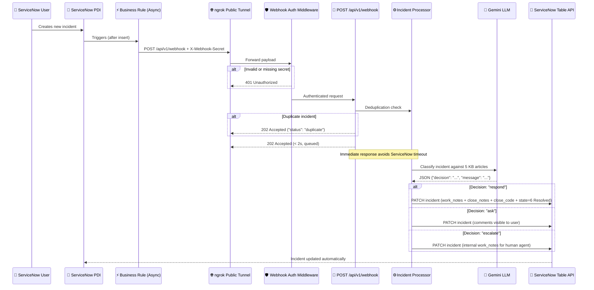

# ServiceNow Agentic Incident Flow (Task 0)

An automated IT incident triage pipeline connecting **ServiceNow Personal Developer Instance (PDI)** and **Google Gemini LLM** via a secure, high-performance **FastAPI** backend service.

---

## Architecture Flow



---

## 1. Quickstart: How to Run the App

### Step 1: Environment Configuration
Ensure your `.env` file in the project root is configured:

```env
# Gemini API Key (from https://aistudio.google.com/apikey)
GEMINI_API_KEY=your_gemini_api_key_here
GEMINI_MODEL=gemini-3.6-flash

# ServiceNow PDI Instance
SERVICENOW_INSTANCE_URL=https://devXXXXXX.service-now.com
SERVICENOW_USERNAME=agent
SERVICENOW_PASSWORD=your_password_here
WEBHOOK_SECRET=task0-secret-key-2026
```

### Step 2: Start the FastAPI Server
Open a terminal in the project directory and run:

```bash
uv run uvicorn src.main:app --reload --port 8000
```

You should see logs indicating:
- `Configuration validated ✓`
- `All services initialized ✓`
- `Webhook ready at POST /api/v1/webhook`
- `Health check at GET /api/v1/health`
- `Uvicorn running on http://127.0.0.1:8000`

---

## 2. Interactive Browser Testing (Swagger UI)

FastAPI provides an interactive web interface out of the box:

1. Open your browser and navigate to:
   👉 **http://localhost:8000/docs**

2. **Test Health Endpoint:**
   - Click on **GET /api/v1/health**
   - Click **Try it out** ➔ **Execute**
   - Result: `200 OK`

3. **Test Webhook Endpoint:**
   - Click on **POST /api/v1/webhook**
   - Click **Try it out**
   - In **X-Webhook-Secret**, enter: `task0-secret-key-2026`
   - In **Request body**, enter a sample payload:
     ```json
     {
       "incident_sys_id": "test_sys_id_001",
       "number": "INC0010001",
       "short_description": "Printer not printing after office move",
       "description": "It was working yesterday. I tried turning it off and on.",
       "priority": 3
     }
     ```
   - Click **Execute** ➔ Result: `202 Accepted`!

---

## 3. Exposing via ngrok for ServiceNow

1. In a second terminal window, run:
   ```bash
   ngrok http 8000
   ```
2. Note your public forwarding HTTPS URL.
3. Your public webhook endpoint URL is:
   `https://<your-subdomain>.ngrok-free.app/api/v1/webhook`

---

## 4. Setting up ServiceNow Business Rule

1. Log into your ServiceNow instance.
2. Navigate to **System Definition > Business Rules** and click **New**.
3. Configure the Business Rule:
   - **Name**: `Task0 Agentic Incident Webhook`
   - **Table**: `Incident [incident]`
   - **Active**: Checked
   - **Advanced**: Checked
4. Under the **When to run** tab:
   - **When**: `after`
   - **Insert**: Checked
5. Under the **Advanced** tab, paste the code from `assets/business_rule.js`:
   ```javascript
   (function executeRule(current, previous /*null when async*/) {
       try {
           var payload = {
               "incident_sys_id": current.getValue('sys_id'),
               "number": current.getValue('number'),
               "short_description": current.getValue('short_description'),
               "description": current.getValue('description'),
               "priority": parseInt(current.getValue('priority'), 10)
           };

           var r = new sn_ws.RESTMessageV2();
           r.setEndpoint('https://<your-subdomain>.ngrok-free.app/api/v1/webhook');
           r.setHttpMethod('POST');
           r.setRequestHeader('Content-Type', 'application/json');
           r.setRequestHeader('X-Webhook-Secret', 'task0-secret-key-2026');
           r.setRequestBody(JSON.stringify(payload));
           r.executeAsync();

           gs.info('Task0: sent incident ' + current.getValue('number'));
       } catch (ex) {
           gs.error('Task0: failed to send incident: ' + ex.message);
       }
   })(current, previous);
   ```
6. Click **Submit**.

---

## 5. End-to-End Test Scenarios

| Scenario | Short Description | Description | Expected Decision | Resulting Action on Ticket |
|---|---|---|---|---|
| **Incident 1** | `Printer not printing after office move` | `It was working yesterday. I tried turning it off and on.` | **`respond`** | Ticket resolved (`state=6`), `close_code="Solution provided"`, solution posted in `work_notes` & `close_notes`. |
| **Incident 2** | `Cannot send email` | `It just doesn't work.` | **`ask`** | Clarifying question added to customer-facing `comments`. |
| **Incident 3** | `Request: annual leave approval` | `I would like to take next week off.` | **`escalate`** | Internal `work_notes` added routing to a human agent. |

---

## 6. Automated Testing (99% Coverage)

```bash
# Run all unit, integration, and E2E tests
uv run pytest -v

# Run with test coverage report
uv run pytest --cov=src -v
```

---

## 7. Deliverables

- `prompt.txt`: The exact system instruction and prompt template sent to Gemini.
- `reflection.md`: Detailed engineering reflection on challenges, architectural decisions, and production roadmap.
- `assets/`: Reference knowledge base, test incidents, and Business Rule script.
